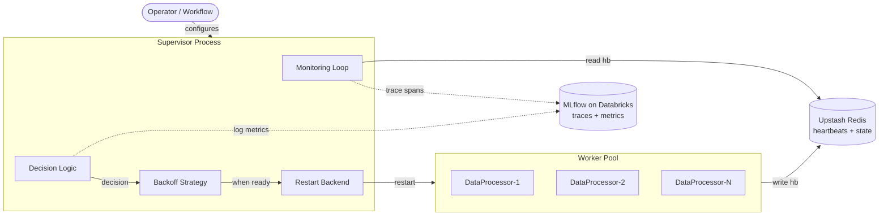
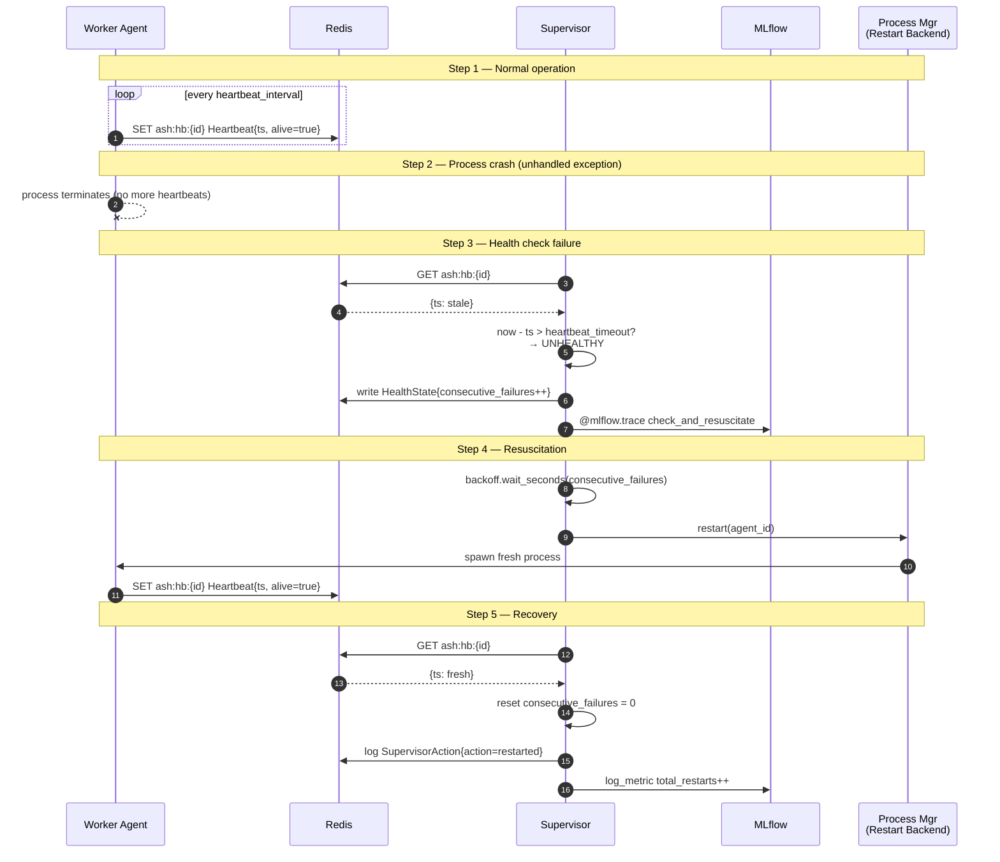
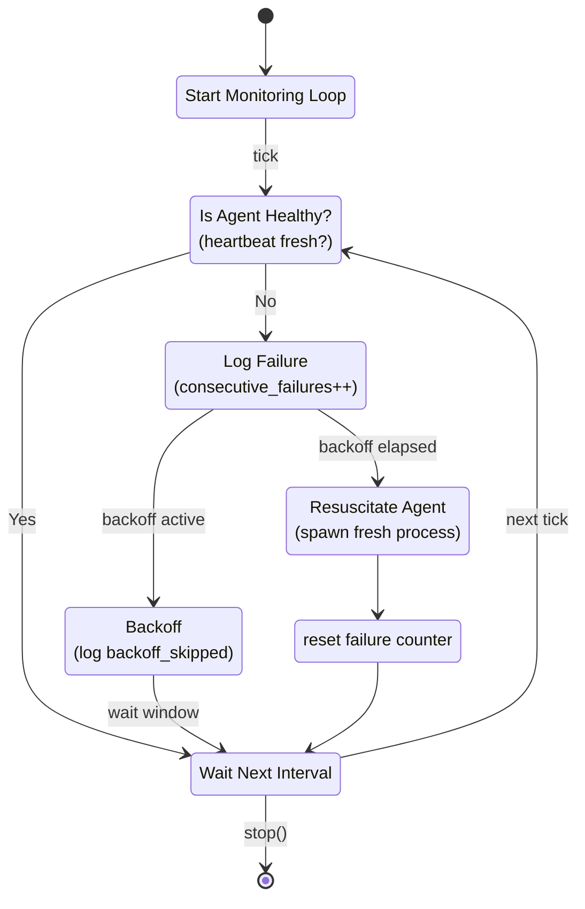
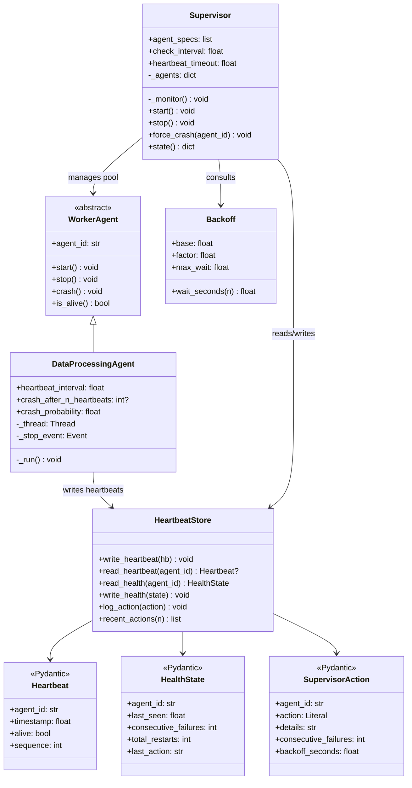
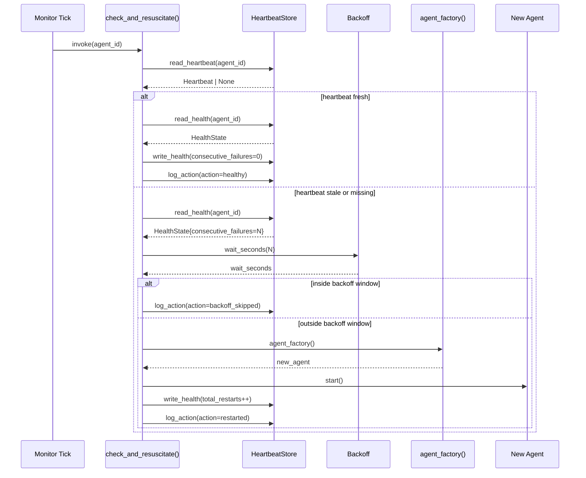
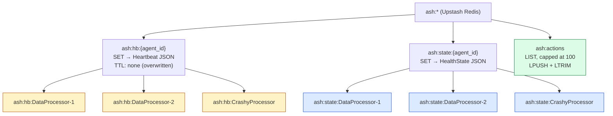
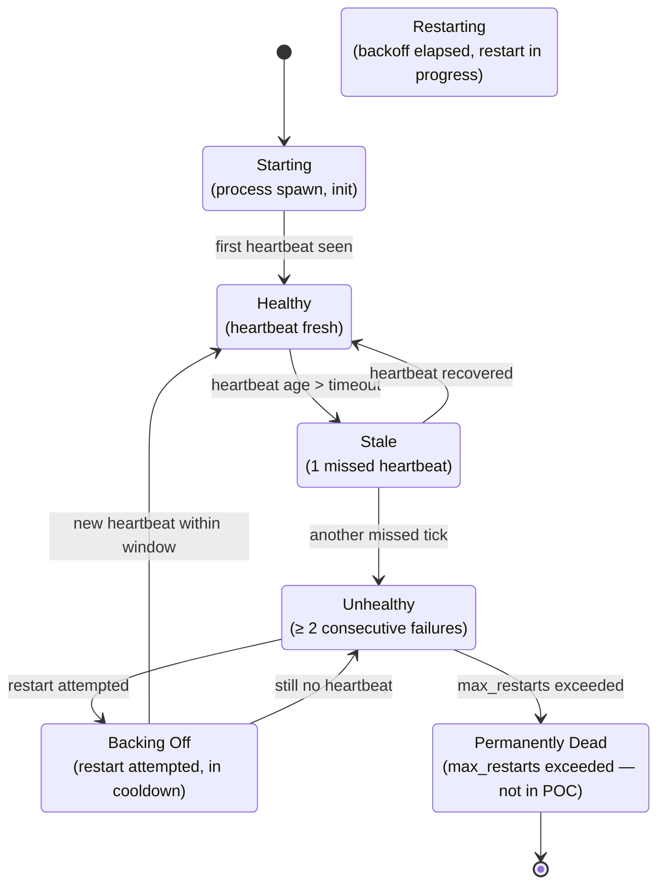

# Architecture & Visualizations

> Mermaid diagrams for the **Auto-Healing Agent Resuscitation** implementation.
> See [README.md](../README.md) for prose and [PLAN.md](../PLAN.md) for the build plan.

---

## Table of Contents

1. [System Context](#1-system-context)
2. [The 5-Step Auto-Healing Workflow](#2-the-5-step-auto-healing-workflow)
3. [Supervisor Monitoring Loop](#3-supervisor-monitoring-loop)
4. [Component Diagram](#4-component-diagram)
5. [Heartbeat & Restart Sequence](#5-heartbeat--restart-sequence)
6. [Crash-Loop Backoff Timeline](#6-crash-loop-backoff-timeline)
7. [Redis Key Layout](#7-redis-key-layout)
8. [POC Architecture (Notebook)](#8-poc-architecture-notebook)
9. [Failure & Recovery States](#9-failure--recovery-states)

---

## 1. System Context

High-level view: the supervisor sits *outside* the worker pool and observes it indirectly through **Redis** (shared state) and **MLflow** (observability). It does not communicate with workers directly.



---

## 2. The 5-Step Auto-Healing Workflow

Sequence diagram showing the full recovery cycle from the docs.



---

## 3. Supervisor Monitoring Loop

The exact flowchart from the docs, re-rendered as a Mermaid `stateDiagram-v2`.



---

## 4. Component Diagram

Class structure of the POC + planned package layout. ABCs are in `<<abstract>>` style; concrete classes extend them.



---

## 5. Heartbeat & Restart Sequence

A closer look at one full supervisor cycle.



---

## 6. Crash-Loop Backoff Timeline

How backoff delays grow across consecutive failures. The cap (`max_wait`) prevents unbounded growth.

```mermaid
gantt
    title Crash-Loop Backoff Schedule (base=2s, factor=2, max=20s)
    dateFormat  X
    axisFormat %s

    section Failure 1
    Crash → Detect          :a1, 0, 1s
    Backoff (2s)            :crit, b1, after a1, 2s
    Restart                 :active, c1, after b1, 1s

    section Failure 2
    Crash → Detect          :a2, after c1, 1s
    Backoff (4s)            :crit, b2, after a2, 4s
    Restart                 :active, c2, after b2, 1s

    section Failure 3
    Crash → Detect          :a3, after c2, 1s
    Backoff (8s)            :crit, b3, after a3, 8s
    Restart                 :active, c3, after b3, 1s

    section Failure 4
    Crash → Detect          :a4, after c3, 1s
    Backoff (16s)           :crit, b4, after a4, 16s
    Restart                 :active, c4, after b4, 1s

    section Failure 5+
    Crash → Detect          :a5, after c4, 1s
    Backoff (capped 20s)    :crit, b5, after a5, 20s
    Restart                 :active, c5, after b5, 1s
```



---

## 7. Redis Key Layout

Storage organization under the `ash:` (auto-self-healing) prefix. Heartbeats and state are per-agent; the action log is shared.



### Key access pattern

| Key | Written by | Read by | Operation |
|---|---|---|---|
| `ash:hb:{id}` | Worker | Supervisor | `SET` (overwrite) / `GET` |
| `ash:state:{id}` | Supervisor | Supervisor | `SET` / `GET` |
| `ash:actions` | Supervisor | Anyone (debug/UI) | `LPUSH` + `LTRIM` + `LRANGE` |

---

## 8. POC Architecture (Notebook)

What runs where in [notebooks/poc.ipynb](../notebooks/poc.ipynb). The notebook is the only "client" — workers and supervisor live as in-process threads.

```mermaid
flowchart TB
    subgraph NB[Jupyter Notebook Kernel]
        T1[Thread: agent-DataProcessor-1]
        T2[Thread: agent-DataProcessor-2]
        TS[Thread: supervisor]
        HF[HeartbeatStore<br/>in-memory wrapper]
    end

    subgraph UR[Upstash Redis]
        HB["ash:hb:*"]
        ST["ash:state:*"]
        AC["ash:actions"]
    end

    subgraph DB[Databricks MLflow]
        SP[Trace Spans<br/>is_agent_healthy<br/>check_and_resuscitate<br/>supervisor.monitor_cycle]
        MT[Metrics<br/>*_consecutive_failures<br/>*_total_restarts]
    end

    T1 -->|write_heartbeat| HF
    T2 -->|write_heartbeat| HF
    HF -->|SET/GET| UR

    TS -->|read_health /<br/>read_heartbeat| HF
    HF -->|SET/GET| UR
    TS -->|force_crash| T1
    TS -->|new DataProcessingAgent.start| T1

    TS -.->|@mlflow.trace| SP
    TS -.->|mlflow.log_metric| MT
```

---

## 9. Failure & Recovery States

A `stateDiagram-v2` of a single worker agent's lifecycle, as seen by the supervisor. The supervisor's view of an agent transitions through these states based on heartbeat freshness and restart events.



---

## Reading Order

If you're new to the codebase, read the diagrams in this order:

1. **[§1 System Context](#1-system-context)** — see the big picture
2. **[§2 5-Step Workflow](#2-the-5-step-auto-healing-workflow)** — understand the core loop
3. **[§3 Monitoring Loop](#3-supervisor-monitoring-loop)** — the supervisor's decision state machine
4. **[§4 Component Diagram](#4-component-diagram)** — the code structure
5. **[§5 Heartbeat & Restart Sequence](#5-heartbeat--restart-sequence)** — drill into one cycle
6. **[§7 Redis Key Layout](#7-redis-key-layout)** — understand persistence
7. **[§8 POC Architecture](#8-poc-architecture-notebook)** — see how the notebook ties it together
8. **[§9 Failure & Recovery States](#9-failure--recovery-states)** — worker lifecycle from supervisor's view

---

## Mermaid Rendering

These diagrams render in:

- ✅ **GitHub** — Mermaid is supported in markdown files in any repo
- ✅ **VS Code** — with the *Markdown Preview Mermaid Support* extension (or built-in if you have GitHub Copilot)
- ✅ **Databricks notebooks** — Mermaid rendering in markdown cells (since DB Runtime 11+)
- ✅ **MkDocs / Docusaurus** — with the `mermaid2` plugin
- ✅ **mkdocs-material** — with `pymdownx.superfences` + custom fence `mermaid`

For a quick local preview:

```bash
# Option 1: npx (no install)
npx -y @mermaid-js/mermaid-cli -i docs/ARCHITECTURE.md -o /tmp/preview

# Option 2: VS Code — open this file and use the Mermaid preview extension
```
