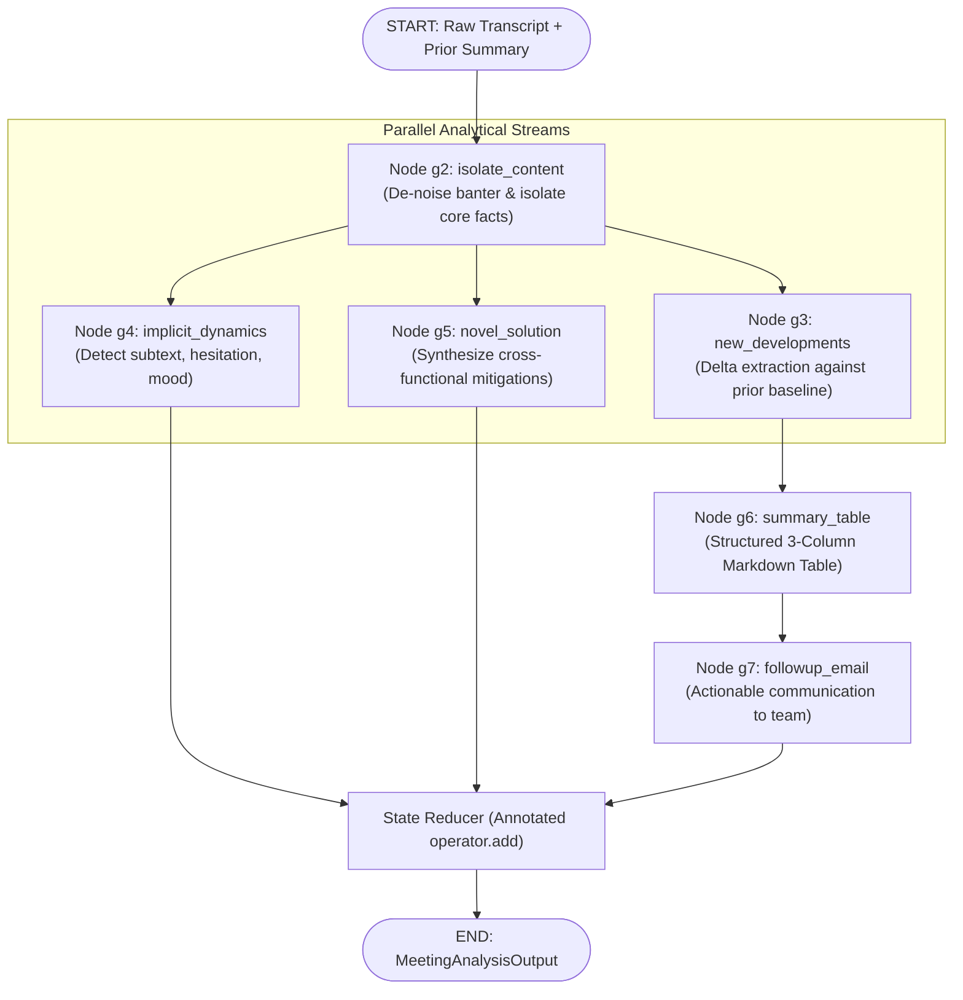

# Context Chaining Meeting Analysis POC

> Production implementation of **Context Chaining / Semantic Blueprint Pipeline** adapted from Chapter 1 of *From Prompts to Context: Building the Semantic Blueprint* (Context Engineering). Built with **LangGraph**, **LangChain**, **NVIDIA Build NIM** (`nvidia/nemotron-3-super-120b-a12b`), and **Databricks MLflow Observability**.

---

## 🌟 Overview

Instead of submitting raw, noisy transcripts into a single unconstrained prompt, this system routes conversational transcripts through a modular **LangGraph `StateGraph`** where each node performs a targeted analytical transformation:



---

## 🚀 Key Features

1. **Modular LangGraph StateGraph**:
   - **$g_2$ (`isolate_content`)**: Strips greetings and off-topic banter (e.g. coffee) while keeping decisions and problems.
   - **$g_3$ (`new_developments`)**: Identifies state deltas relative to historical meeting summaries (simulated RAG).
   - **$g_4$ (`implicit_dynamics`)**: Reads between the lines for interpersonal tension, hesitation, and workload pressure.
   - **$g_5$ (`novel_solution`)**: Merges disconnected facts (e.g., frontend extra bandwidth + backend delay) into actionable mitigation.
   - **$g_6$ (`summary_table`)**: Generates a clean 3-column Markdown table (`Topic | Decision/Outcome | Owner`).
   - **$g_7$ (`followup_email`)**: Drafts a polite, professional team email with assigned action items.

2. **NVIDIA Build NIM Model**:
   - Model: `nvidia/nemotron-3-super-120b-a12b`
   - Target Endpoint: `https://integrate.api.nvidia.com/v1`
   - Built-in transient exponential backoff retries on 503 / 429 server errors.

3. **Databricks MLflow Observability**:
   - Auto-tracing enabled with `mlflow.langchain.autolog()`.
   - Captures spans, latency per node, token counts, and input/output payloads directly to your Databricks workspace.

---

## 📂 Repository Structure

```text
cot-meeting-analysis/
├── notebooks/
│   └── cot_meeting_analysis_poc.ipynb     # Interactive Jupyter Notebook POC (fully executed)
├── sample_data/
│   ├── sample_transcript.txt              # Sample meeting transcript fixture
│   └── previous_summary.txt               # Baseline context fixture
├── docs/
│   └── implementation_plan.md             # Specification & design document
├── .env.example                           # Template for environment variables
├── pyproject.toml                         # Project dependencies and packaging
└── README.md                              # This file
```

---

## 🛠️ Quickstart & Execution

### 1. Requirements & Environment
Make sure the following environment variables are set in your zsh environment or in `.env`:

```bash
export NVIDIA_API_KEY="nvapi-..."
export NVIDIA_BASE_URL="https://integrate.api.nvidia.com/v1"
export NVIDIA_MODEL_NAME="nvidia/nemotron-3-super-120b-a12b"

export DATABRICKS_HOST="https://<your-workspace>.cloud.databricks.com"
export DATABRICKS_TOKEN="dapi..."
export MLFLOW_TRACKING_URI="databricks"
export MLFLOW_EXPERIMENT_ID="<your-experiment-id>"
```

### 2. Install Dependencies
```bash
uv sync
```

### 3. Run the Jupyter Notebook POC
Launch Jupyter or execute the notebook directly:
```bash
# Launch interactive Jupyter interface
uv run jupyter lab notebooks/cot_meeting_analysis_poc.ipynb

# Or execute from CLI
uv run jupyter nbconvert --to notebook --execute notebooks/cot_meeting_analysis_poc.ipynb --output notebooks/cot_meeting_analysis_poc.ipynb
```
