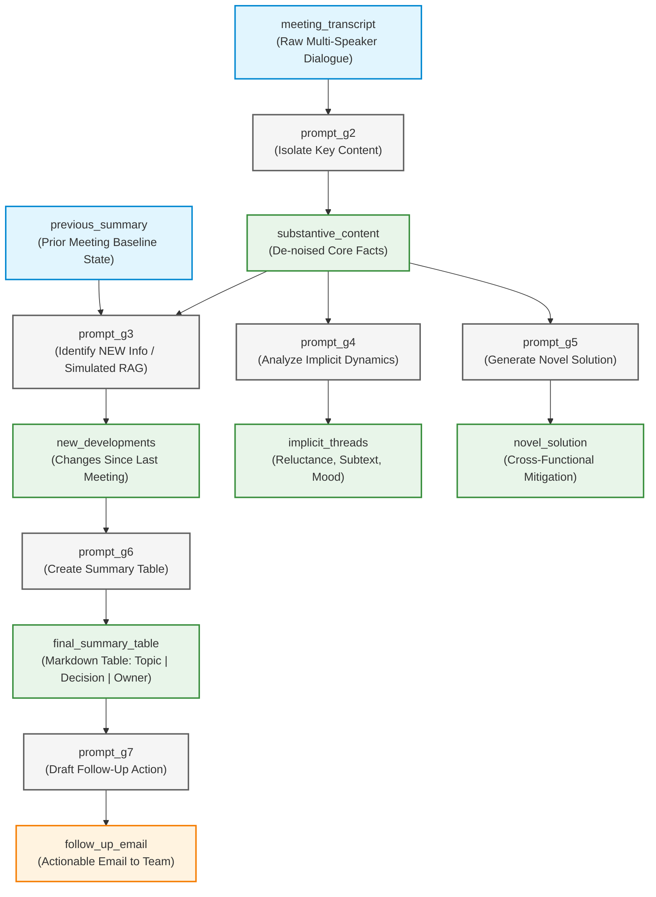

```markdown
# Meeting Analysis POC: Chapter 1 Implementation Plan

This technical specification details the implementation plan for building a Proof of Concept (POC) based on Chapter 1 of *From Prompts to Context: Building the Semantic Blueprint* (Context Engineering)[cite: 4]. The POC implements a **Context Chaining** pipeline that transforms a raw meeting transcript into structured, actionable business artifacts using a sequence of focused LLM calls rather than a single massive prompt[cite: 4].

---

## 1. Context Chaining Architecture & Flowchart

Instead of submitting the entire raw transcript into an unconstrained single prompt, the system chains modular prompt steps where each node isolates, enriches, or formats the context[cite: 4].

### Mermaid Execution Diagram



---

## 2. Node Specifications & Prompt Contracts

The workflow consists of six sequential/branching steps directly adapted from Chapter 1:

### 2.1 Node $g_2$: Isolate Key Content

* **Purpose**: Clean raw data by stripping chit-chat, greetings, and off-topic banter (e.g., coffee/food) while keeping only decisions, updates, and problems.


* **Inputs**: `meeting_transcript`

* **Output Variable**: `substantive_content`

* **Exact Prompt Contract**:

```text
Analyze the following meeting transcript. Your task is to isolate the substantive content from the conversational noise.
- Substantive content includes: decisions made, project updates, problems raised, and strategic suggestions.
- Noise includes: greetings, pleasantries, and off-topic remarks (like coffee).
Return ONLY the substantive content.

Transcript:
---
{meeting_transcript}
---

```

---

### 2.2 Node $g_3$: Identify New Developments (Simulated RAG)

* **Purpose**: Compare the substantive content against previous meeting memory (`previous_summary`) to extract only the state delta.


* **Inputs**: `substantive_content`, `previous_summary`

* **Output Variable**: `new_developments`

* **Exact Prompt Contract**:

```text
Context: The summary of our last meeting was: "{previous_summary}"

Task: Analyze the following substantive content from our new meeting. Identify and summarize ONLY the new developments, problems, or decisions that have occurred since the last meeting.

New Meeting Content:
---
{substantive_content}
---

```

---

### 2.3 Node $g_4$: Analyze Implicit Dynamics

* **Purpose**: Read between the lines to capture subtext, hesitation, interpersonal reluctance, workload issues, and mood.


* **Inputs**: `substantive_content`

* **Output Variable**: `implicit_threads`

* **Exact Prompt Contract**:

```text
Task: Analyze the following meeting content for implicit social dynamics and unstated feelings. Go beyond the literal words.
- Did anyone seem hesitant or reluctant despite agreeing to something?
- Were there any underlying disagreements or tensions?
- What was the overall mood?

Meeting Content:
---
{substantive_content}
---

```

---

### 2.4 Node $g_5$: Generate Novel Solution

* **Purpose**: Synthesize cross-functional constraints (e.g., frontend spare capacity vs. backend gateway blocker) into a creative mitigation strategy.


* **Inputs**: `substantive_content`

* **Output Variable**: `novel_solution`

* **Exact Prompt Contract**:

```text
Context: In the meeting, Maria suggested a 'soft launch' to avoid server strain, and also mentioned her team has 'extra bandwidth'. Tom is facing a 3-day delay on the backend.

Task: Propose a novel, actionable idea that uses Maria's team's extra bandwidth to help mitigate Tom's 3-day delay. Combine these two separate pieces of information into a single solution.
---
{substantive_content}
---

```

---

### 2.5 Node $g_6$: Create Summary Table

* **Purpose**: Force clarity and structural reusability by transforming the text into a 3-column Markdown table.


* **Inputs**: `new_developments`

* **Output Variable**: `final_summary_table`

* **Exact Prompt Contract**:

```text
Task: Create a final, concise summary of the meeting in a markdown table. Use the following information to construct the table.

- New Developments: {new_developments}

The table should have three columns: "Topic", "Decision/Outcome", and "Owner".

```

---

### 2.6 Node $g_7$: Draft Follow-up Action

* **Purpose**: Close the loop from analytical insight to operational action by producing a polished email.


* **Inputs**: `final_summary_table`

* **Output Variable**: `follow_up_email`

* **Exact Prompt Contract**:

```text
Task: Based on the following summary table, draft a polite and professional follow-up email to the team (Sarah, Tom, Maria).
The email should clearly state the decisions made and the action items for each person.

Summary Table:
---
{final_summary_table}
---

```

---

## 3. Recommended Project Layout

```text
meeting_analysis_poc/
├── .env.example
├── pyproject.toml
├── main.py
├── sample_data/
│   ├── sample_transcript.txt
│   └── previous_summary.txt
├── src/
│   ├── __init__.py
│   ├── config.py
│   ├── models.py
│   ├── prompts.py
│   └── engine.py
└── tests/
    ├── __init__.py
    └── test_pipeline.py

```

---

## 4. Python Implementation Files

### 4.1 `pyproject.toml`

```toml
[project]
name = "meeting-analysis-poc"
version = "0.1.0"
description = "Context Chaining Meeting Analysis POC from Chapter 1"
dependencies = [
    "openai>=1.30.0",
    "pydantic>=2.7.0",
    "pydantic-settings>=2.2.0",
    "python-dotenv>=1.0.0"
]

[project.optional-dependencies]
dev = [
    "pytest>=8.0.0"
]

```

### 4.2 `src/config.py`

```python
import os
from openai import OpenAI
from dotenv import load_dotenv

load_dotenv()

def get_openai_client() -> OpenAI:
    api_key = os.getenv("OPENAI_API_KEY")
    if not api_key:
        # Check Google Colab userdata fallback
        try:
            from google.colab import userdata
            api_key = userdata.get("API_KEY") or userdata.get("OPENAI_API_KEY")
        except Exception:
            pass
            
    if not api_key:
        raise ValueError("OPENAI_API_KEY is not set.")
    return OpenAI(api_key=api_key)

MODEL_NAME = os.getenv("OPENAI_MODEL", "gpt-5")

```

### 4.3 `src/models.py`

```python
from pydantic import BaseModel, Field
from typing import List, Optional

class PipelineStepLog(BaseModel):
    step_id: str
    prompt_used: str
    output: str
    latency_ms: float

class MeetingAnalysisInput(BaseModel):
    meeting_transcript: str
    previous_summary: str

class MeetingAnalysisOutput(BaseModel):
    substantive_content: str
    new_developments: str
    implicit_threads: str
    novel_solution: str
    final_summary_table: str
    follow_up_email: str
    logs: List[PipelineStepLog] = Field(default_factory=list)

```

### 4.4 `src/prompts.py`

```python
PROMPT_G2 = """Analyze the following meeting transcript. Your task is to isolate the substantive content from the conversational noise.
- Substantive content includes: decisions made, project updates, problems raised, and strategic suggestions.
- Noise includes: greetings, pleasantries, and off-topic remarks (like coffee).
Return ONLY the substantive content.

Transcript:
---
{meeting_transcript}
---"""

PROMPT_G3 = """Context: The summary of our last meeting was: "{previous_summary}"

Task: Analyze the following substantive content from our new meeting. Identify and summarize ONLY the new developments, problems, or decisions that have occurred since the last meeting.

New Meeting Content:
---
{substantive_content}
---"""

PROMPT_G4 = """Task: Analyze the following meeting content for implicit social dynamics and unstated feelings. Go beyond the literal words.
- Did anyone seem hesitant or reluctant despite agreeing to something?
- Were there any underlying disagreements or tensions?
- What was the overall mood?

Meeting Content:
---
{substantive_content}
---"""

PROMPT_G5 = """Context: In the meeting, Maria suggested a 'soft launch' to avoid server strain, and also mentioned her team has 'extra bandwidth'. Tom is facing a 3-day delay on the backend.

Task: Propose a novel, actionable idea that uses Maria's team's extra bandwidth to help mitigate Tom's 3-day delay. Combine these two separate pieces of information into a single solution.
---
{substantive_content}
---"""

PROMPT_G6 = """Task: Create a final, concise summary of the meeting in a markdown table. Use the following information to construct the table.

- New Developments: {new_developments}

The table should have three columns: "Topic", "Decision/Outcome", and "Owner"."""

PROMPT_G7 = """Task: Based on the following summary table, draft a polite and professional follow-up email to the team (Sarah, Tom, Maria).
The email should clearly state the decisions made and the action items for each person.

Summary Table:
---
{final_summary_table}
---"""

```

### 4.5 `src/engine.py`

```python
import time
from typing import Tuple
from openai import OpenAI
from src.config import get_openai_client, MODEL_NAME
from src.models import MeetingAnalysisInput, MeetingAnalysisOutput, PipelineStepLog
from src import prompts

class ContextChainingEngine:
    def __init__(self, client: OpenAI = None, model: str = MODEL_NAME):
        self.client = client or get_openai_client()
        self.model = model

    def _call_step(self, step_id: str, prompt_text: str) -> Tuple[str, PipelineStepLog]:
        start = time.perf_counter()
        response = self.client.chat.completions.create(
            model=self.model,
            messages=[{"role": "user", "content": prompt_text}]
        )
        elapsed_ms = (time.perf_counter() - start) * 1000.0
        output_content = response.choices[0].message.content.strip()

        log = PipelineStepLog(
            step_id=step_id,
            prompt_used=prompt_text,
            output=output_content,
            latency_ms=round(elapsed_ms, 2)
        )
        return output_content, log

    def execute(self, payload: MeetingAnalysisInput) -> MeetingAnalysisOutput:
        logs = []

        # Step g2: De-noise transcript
        p_g2 = prompts.PROMPT_G2.format(meeting_transcript=payload.meeting_transcript)
        substantive_content, log_g2 = self._call_step("g2_isolate_content", p_g2)
        logs.append(log_g2)

        # Step g3: Delta against historical baseline
        p_g3 = prompts.PROMPT_G3.format(
            previous_summary=payload.previous_summary,
            substantive_content=substantive_content
        )
        new_developments, log_g3 = self._call_step("g3_new_developments", p_g3)
        logs.append(log_g3)

        # Step g4: Subtext and implicit dynamics
        p_g4 = prompts.PROMPT_G4.format(substantive_content=substantive_content)
        implicit_threads, log_g4 = self._call_step("g4_implicit_threads", p_g4)
        logs.append(log_g4)

        # Step g5: Synthesize novel cross-functional mitigation
        p_g5 = prompts.PROMPT_G5.format(substantive_content=substantive_content)
        novel_solution, log_g5 = self._call_step("g5_novel_solution", p_g5)
        logs.append(log_g5)

        # Step g6: Markdown summary table
        p_g6 = prompts.PROMPT_G6.format(new_developments=new_developments)
        final_summary_table, log_g6 = self._call_step("g6_summary_table", p_g6)
        logs.append(log_g6)

        # Step g7: Follow-up action email
        p_g7 = prompts.PROMPT_G7.format(final_summary_table=final_summary_table)
        follow_up_email, log_g7 = self._call_step("g7_follow_up_email", p_g7)
        logs.append(log_g7)

        return MeetingAnalysisOutput(
            substantive_content=substantive_content,
            new_developments=new_developments,
            implicit_threads=implicit_threads,
            novel_solution=novel_solution,
            final_summary_table=final_summary_table,
            follow_up_email=follow_up_email,
            logs=logs
        )

```

---

## 5. Benchmark Fixture Data & Testing

### 5.1 `sample_data/sample_transcript.txt`

```text
Tom: Morning all. Coffee is still kicking in.
Sarah: Morning, Tom. Right, let's jump in. Project Phoenix timeline. Tom, you said the backend components are on track?
Tom: Mostly. We hit a small snag with the payment gateway integration. It's... more complex than the docs suggested. We might need another three days.
Maria: Three days? Tom, that's going to push the final testing phase right up against the launch deadline. We don't have that buffer.
Sarah: I agree with Maria. What's the alternative, Tom?
Tom: I suppose I could work over the weekend to catch up. I'd rather not, but I can see the bind we're in.
Sarah: Appreciate that, Tom. Let's tentatively agree on that. Maria, what about the front-end?
Maria: We're good. In fact, we're a bit ahead. We have some extra bandwidth.
Sarah: Excellent. Okay, one last thing. The marketing team wants to do a big social media push on launch day. Thoughts?
Tom: Seems standard.
Maria: I think that's a mistake. A big push on day one will swamp our servers if there are any initial bugs. We should do a soft launch, invite-only for the first week, and then do the big push. More controlled.
Sarah: That's a very good point, Maria. A much safer strategy. Let's go with that. Okay, great meeting. I'll send out a summary.
Tom: Sounds good. Now, more coffee.

```

### 5.2 `sample_data/previous_summary.txt`

```text
In our last meeting, we finalized the goals for Project Phoenix and assigned backend work to Tom and front-end to Maria.

```

### 5.3 Automated Validation Suite (`tests/test_pipeline.py`)

```python
import pytest
from src.engine import ContextChainingEngine
from src.models import MeetingAnalysisInput

@pytest.fixture
def test_input():
    with open("sample_data/sample_transcript.txt") as f:
        transcript = f.read()
    with open("sample_data/previous_summary.txt") as f:
        prev_sum = f.read()
    return MeetingAnalysisInput(
        meeting_transcript=transcript,
        previous_summary=prev_sum
    )

def test_context_chaining_pipeline(test_input):
    engine = ContextChainingEngine()
    result = engine.execute(test_input)

    # 1. Pipeline verification
    assert len(result.logs) == 6

    # 2. De-noising check (g2)
    assert "coffee" not in result.substantive_content.lower()
    assert "payment gateway" in result.substantive_content.lower()

    # 3. Implicit Dynamics check (g4)
    implicit = result.implicit_threads.lower()
    assert any(w in implicit for w in ["reluctan", "hesitan", "weekend", "pressure"])

    # 4. Table check (g6)
    assert "| Topic" in result.final_summary_table or "|Topic" in result.final_summary_table
    assert "Owner" in result.final_summary_table

    # 5. Email check (g7)
    assert "Tom" in result.follow_up_email
    assert "Maria" in result.follow_up_email
    assert "Sarah" in result.follow_up_email

```

---

## 6. Coding Agent Execution Checklist

* [ ] **Step 1**: Install requirements (`pip install openai pydantic pydantic-settings python-dotenv pytest`).
* [ ] **Step 2**: Create `.env` and configure `OPENAI_API_KEY`.
* [ ] **Step 3**: Place the sample fixtures in `sample_data/`.
* [ ] **Step 4**: Implement `src/prompts.py`, `src/models.py`, `src/config.py`, and `src/engine.py`.
* [ ] **Step 5**: Execute `pytest tests/test_pipeline.py -v` to ensure all assertion rules pass.

```

```
