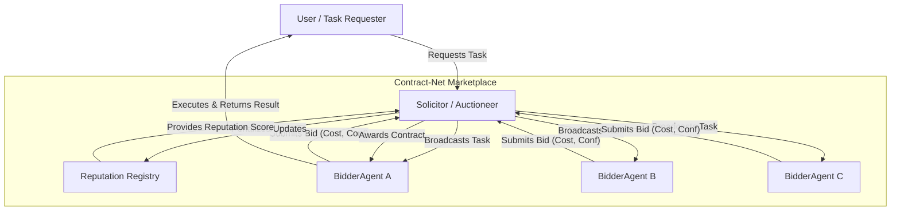
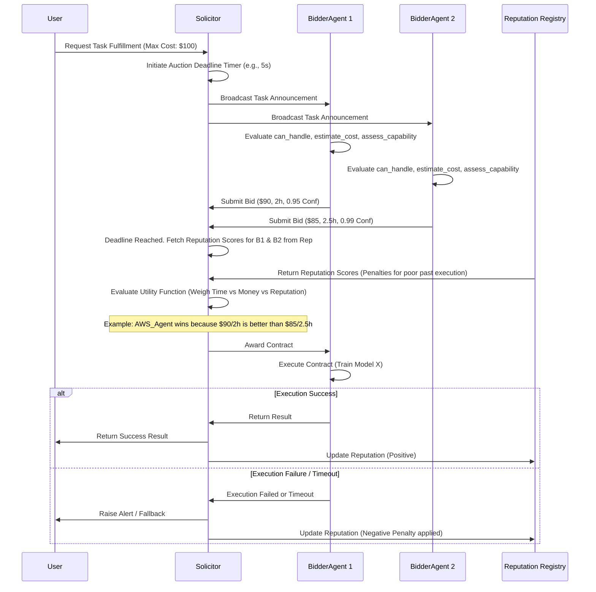

Here is a comprehensive **Functional Design Specification (FDS)** for the **Contract-Net Marketplace Multi-Agent Orchestration System**, derived directly from the provided textual context and diagrams. It defines the functional requirements, architecture, workflows, and constraints of the system.

---

# Functional Design Specification (FDS)
## Multi-Agent Orchestration Engine via Contract-Net Marketplace

### 1. Introduction & Scope
**1.1 Purpose**
This document specifies the functional design for a dynamic task allocation system using the **Contract-Net Protocol**. It is designed for distributed environments featuring a diverse, heterogeneous pool of agents with overlapping capabilities. Instead of relying on brittle static routing, this system utilizes a market-driven negotiation mechanism to assign tasks to agents based on real-time variables.

**1.2 Problem Statement**
In distributed multi-agent systems, agents frequently come online/offline, have fluctuating API costs, varying computational load, and uncertain confidence levels regarding their ability to complete specific tasks. Hardcoded routing logic is inflexible and fails to account for these real-time dynamics. The core problem is: *How do we optimally assign a task to the most suitable agent when the optimal choice depends entirely on dynamic, real-time factors such as availability, cost, and confidence?*

---

### 2. System Architecture
The system follows a **Mediator with Bids** architectural pattern. It decouples the task requester from the agent provider through a dedicated negotiation layer.

**2.1 Core Roles**
*   **Solicitor (Orchestrator / Mediator):** Manages the auction lifecycle. It broadcasts task announcements, enforces bidding deadlines, evaluates incoming bids using a utility function, and awards the contract to the highest-scoring bidder.
*   **BidderAgent (Worker / Specialist):** Acts as a specialized resource capable of executing specific tasks. It listens for announcements, evaluates its own capability, calculates compute/API costs, estimates time of arrival (ETA), and generates a confidence score. It submits formal bids to the Solicitor.
*   **Reputation Registry (Cross-Cutting):** A persistent storage module that tracks the historical performance of BidderAgents. Used to penalize agents that win contracts but fail to deliver quality results, mitigating the risk of "gaming" the system.

---

### 3. Core Functional Requirements

#### 3.1 The Contract-Net Auction Protocol
The system must implement a multi-step negotiation flow to assign a single task to an agent.

1.  **Announcement Phase:** The Solicitor broadcasts a task announcement (including task payload, constraints, and a strict bidding deadline) to all active subscribers in the marketplace.
2.  **Bidding Phase:** Upon receiving the announcement, each BidderAgent determines if it can handle the task. If capable, it calculates a **Cost** (e.g., $90), **ETA** (e.g., 2 hours), and **Confidence Score** (e.g., 0.85) and submits a formal `Bid` object to the Solicitor before the deadline.
3.  **Evaluation & Award Phase:** The Solicitor collects all bids and evaluates them against a configurable **Utility Function**.
    *   *Example Logic:* `Utility = α(Confidence) - β(Cost) - γ(ETA)` where α, β, and γ are weightings defined by the user's strict budget or time constraints.
    *   The highest scoring bid wins the contract. The Solicitor issues an award instruction to the winning agent.
4.  **Execution Phase:** The winning agent executes the specific contract (`execute_contract(task)`). The Solicitor awaits the result or initiates a timeout fallback.
5.  **Feedback Loop:** Upon completion (or failure), the result is reported back to the system. If an agent fails to meet quality standards defined by the SLAs, the Reputation Registry is updated.

#### 3.2 Core Functions & Interfaces
**Solicitor Module**
*   `broadcast_announcement(task)`: Publishes the task to all available agents.
*   `evaluate_bids(bids_list)`: Implements a configurable utility function to score incoming bids.
*   `award_contract(best_bid)`: Triggers the execution on the winning agent.
*   `enforce_auction_deadline()`: Implements a hard timer to prevent infinite waiting for bids.

**BidderAgent Module**
*   `can_handle(task)`: Boolean check to determine capability for the specific task domain.
*   `estimate_compute_cost(task)`: Calculates internal resource or API usage costs for the task.
*   `assess_capability(task)`: Determines the internal confidence level (0.0 to 1.0) regarding successful execution.

---

### 4. Data Models

**Task Specification**
```json
{
  "task_id": "uuid",
  "description": "Train Model X",
  "constraints": {
    "max_cost": 100.00,
    "max_eta_hours": 4,
    "type": "ML_TRAINING"
  },
  "payload": "{...}"
}
```

**Bid Object (Proposed by Agent)**
```json
{
  "agent_id": "AWS_Agent_01",
  "bid_time": "2026-07-19T12:00:00Z",
  "cost": 90.00,
  "estimated_time_of_arrival": "2.0 hours",
  "confidence_score": 0.92,
  "reputation_penalty": 0.0 // Applied post-execution for failures
}
```

**Contract Object (Awarded)**
```json
{
  "task_id": "uuid",
  "winning_bid": "AWS_Bid_Object",
  "status": "EXECUTING",
  "start_time": "2026-07-19T12:02:00Z",
  "deadline": "2026-07-19T14:02:00Z"
}
```

---

### 5. Non-Functional Requirements (NFRs)

**5.1 Latency & Performance**
*   **Auction Overhead:** The negotiation phase introduces computational overhead. The system must enforce strict, low-latency deadlines for receiving bids to maintain a responsive user experience.
*   **Static Fallback:** For *fixed, predictable workflows* (where agents rarely change), the system must provide a bypass to "Intent-aware routing" (static routing), as the auction overhead would be unjustified.

**5.2 Stability & Fault Tolerance**
*   **High-Stakes Adaptation:** In enterprise systems where agents perform high-stakes or risky actions, efficiency gained via a market-based allocation must be strictly balanced with absolute stability.
*   **No-Bid Handling:** If no bids are received, the `Solicitor` must raise a `NoBidsException` and provide a graceful fallback procedure (e.g., alerting a human operator or escalating to a higher-level orchestrator).
*   **Crash Recovery:** The system must handle Agent crashes. As illustrated in the reference architecture (Figure 5.5), crashed agents (e.g., Scraper Agent) must be detected and restarted to a clean state by a Supervisory hierarchy.

**5.3 Security & Behavior Integrity (Risk of Gaming)**
*   **Truthful Bidding Enforcement:** Without proper incentives, agents might overstate their confidence scores to win tasks. 
*   **Reputation Mechanism:** The system must implement and query a "reputation score" for bidders. When an agent wins a contract but fails to deliver quality results, the reputation penalty must be factored into future utility calculations for that specific agent, discouraging malicious or overconfident bidding.

---

### 6. Implementation Constraints & Recommendations

*   **Dynamic vs Static:** The Contract-Net pattern is exclusively recommended when the system has a large, variable toolset, or is optimizing for dynamic factors such as fluctuating cloud API costs or worker availability. It is **not** recommended for fixed, predictable workflows.
*   **Utility Function Tuning:** The weights for the utility function (Cost vs Confidence vs ETA) must be easily tunable at the Solicitor level, as different user constraints (e.g., "Strict Budget" vs "Strict Speed") will require totally different awarding behaviors.
*   **Scalability:** With a large number of BidderAgents, the broadcast mechanism might cause network flooding. The design should allow for intelligent filtering or subscription-based routing before the broadcast to reduce unnecessary computational overhead on agents that cannot handle the task domain.

---

### 7. Mermaid Diagrams of Flows

**Diagram A: System Component Architecture**
This diagram illustrates the major interacting components of the Contract-Net Marketplace design, including the Solicitor, Bidders, and the cross-cutting Reputation Registry.



**Diagram B: Detailed Auction Sequence Flow**
This sequence diagram details the exact functional interactions occurring during a single market-driven task allocation.

