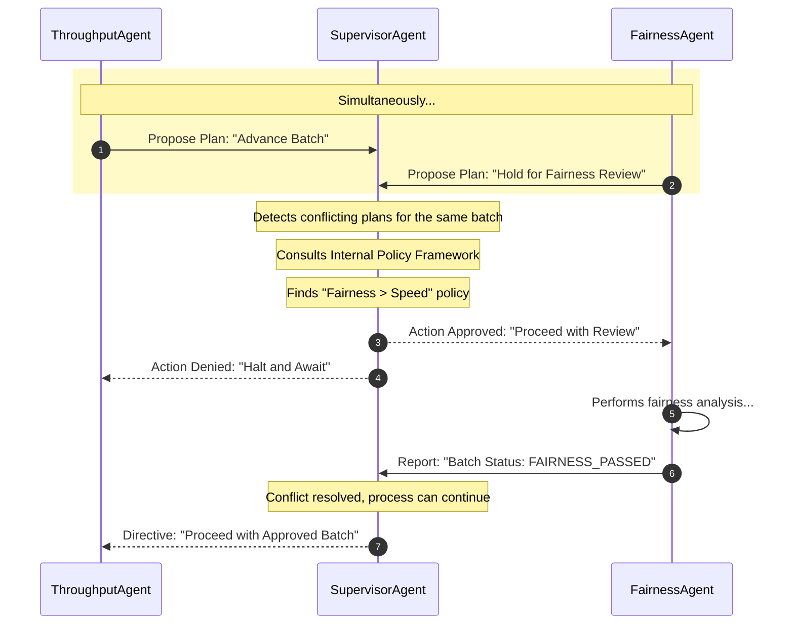
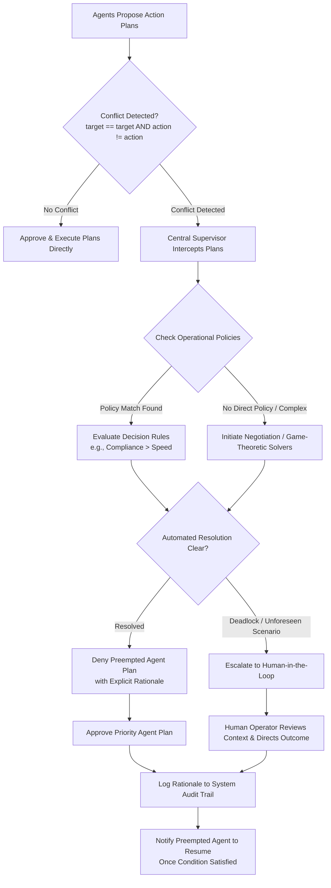

# Solution Design Document: Conflict Resolution Pattern

---

## 1. Executive Summary & Overview

Clear protocols are required to resolve conflicts within multi-agent systems so that the overall system maintains coherence, stability, and operational efficiency—even when individual constituent agents hold divergent goals, conflicting opinions, or draw opposite conclusions. Implementing structured conflict resolution prevents costly system deadlocks and ensures decisions align with global priorities rather than getting stalled by internal disputes. It serves as a foundational pattern for resilient decentralized systems, addressing both logical friction (e.g., abstract task goals, data corruption) and physical arrangement challenges (e.g., robot arm positioning, swarm formation control).

---

## 2. Context & Problem Statement

### 2.1 Context

In a multi-agent system, autonomous agents pursue individual objectives, which inevitably leads to intersecting paths, shared resource contention, or opposing operational goals.

* **Physical Domain Example:** Two logistics agents attempting to route trucks through the same narrow street simultaneously, or two robotic arms attempting to move into the same physical space.
* **Logical Domain Example:** Two financial agents generating opposing trade recommendations for the exact same stock, or two enterprise workflow agents conflicting over batch processing priorities.

### 2.2 Core Problem

How can the system identify and mediate disagreements or conflicting plans between agents to prevent deadlocks, unsafe operational conditions, or suboptimal system outcomes? Allowing agents to execute conflicting actions without mediation leads to system failure, inefficient oscillations, or incoherent global strategies.

### 2.3 Competing Architectural Forces

* **Safety vs. Operational Speed:** Detecting and resolving conflicts prevents physical damage or system failures, but the resolution process introduces processing latency that can slow down high-frequency operations.
* **Centralized Authority vs. Distributed Agility:** A central supervisor provides decisive, consistent, and predictable resolutions, but can become a bottleneck that limits the responsiveness of individual agents.
* **Logical Consistency vs. Local Goal Attainment:** Resolving a conflict requires at least one agent to modify or abandon its active plan, resulting in suboptimal local performance for individual tasks in exchange for overall system integrity.

---

## 3. Four Foundational Resolution Approaches

Rather than allowing agents to stall or execute contradictory actions, the system provides four mediation approaches depending on architecture, control level, and conflict type:

```
                                  ┌─────────────────────────────┐
                                  │ Conflict Resolution Pattern │
                                  └──────────────┬──────────────┘
                                                 │
      ┌─────────────────────────┬────────────────┴────────────────┬────────────────────────┐
      ▼                         ▼                                 ▼                        ▼
┌───────────┐         ┌────────────────────┐            ┌──────────────────┐    ┌────────────────────┐
│Hierarchical│         │    Policy-Based    │            │   Negotiation    │    │   Game-Theoretic   │
│Resolution │         │     Resolution     │            │   (Bottom-Up)    │    │     Resolution     │
└─────┬─────┘         └─────────┬──────────┘            └────────┬─────────┘    └─────────┬──────────┘
      │                         │                                │                        │
      │ Top-down supervisor     │ Predefined rules               │ Peer concession &      │ Mathematical payoffs
      │ overrules agents        │ (e.g., Safety > Speed)         │ counter-offers         │ & Nash equilibrium

```

### 1. Hierarchical Resolution

* **Mechanism:** A designated supervisor or orchestrator agent possesses the explicit authority to overrule conflicting agents and impose binding decisions.
* **Characteristics:** Offers direct, predictable outcomes, mirroring traditional management structures.
* **Best Used For:** Enterprise applications where compliance, safety, dynamic top-down control, and auditable single points of truth are paramount.

### 2. Policy-Based Resolution

* **Mechanism:** Predefined policies and rule sets automatically govern how specific conflict classes are resolved.
* **Characteristics:** Deterministic, reliable, and consistent. Decision logic is externalized, making rules easy to modify and audit without altering internal agent code.
* **Policy Rule Examples:**
* *"Safety-critical agents always have priority over efficiency-optimizing agents."*
* *"Agents handling customer-facing tasks take precedence over internal reporting agents."*


### 3. Negotiation

* **Mechanism:** Conflicting agents engage directly in a peer-to-peer negotiation protocol to arrive at a mutually acceptable compromise.
* **Characteristics:** A bottom-up approach suitable when agents possess enough sophistication to make concessions and evaluate counter-offers for a "win-win" or "less-lose" result.
* **Best Used For:** Adaptable environments requiring nuanced outcomes rather than rigid, pre-programmed policies.

### 4. Game-Theoretic Resolution

* **Mechanism:** Conflicts are formally modeled as strategic games where agent actions are mapped to payoffs and costs.
* **Characteristics:** Identifies provably stable mathematical outcomes, such as a **Nash Equilibrium**, where no single agent can benefit by unilaterally altering its strategy.
* **Best Used For:** Highly complex environments where cooperative behavior needs to emerge naturally from individual agents' rational pursuit of local goals.

---

## 4. Key Architectural Design Principles

To ensure system stability, trustworthiness, and compliance, the conflict resolution framework rests on four operational principles:

```
   ┌──────────────────────────────────────────────────────────────────┐
   │                  System Architectural Principles                 │
   └────────────────────────────────┬─────────────────────────────────┘
                                    │
    ┌─────────────────┬─────────────┴───────────────┬─────────────────┐
    ▼                 ▼                             ▼                 ▼
┌──────────────┐ ┌──────────────┐             ┌──────────────┐ ┌──────────────┐
│  1. Conflict │ │2. Explainable│             │ 3. Escalation│ │ 4. Simulation│
│   Detection  │ │ Resolutions  │             │ Path (HITL)  │ │   Testing    │
└──────────────┘ └──────────────┘             └──────────────┘ └──────────────┘

```

1. **Conflict Detection (Early Warning System):** Conflicts must be identified before resolution can begin. Implemented through:
* A centralized supervisor agent monitoring active plans.
* Resource locking mechanisms (agents locking finite resources prior to usage).
* Shared action registration spaces where plans must be registered prior to execution.


2. **Explainable Resolutions (Audit Trail):** Every mediated decision logs its underlying rationale to guarantee transparency, debugging, compliance, and human verifiability.
* *Log Entry Example:* `"Agent B's plan was approved over Agent A's because policy [number] states that safety-critical tasks have priority over all others."`


3. **Defined Escalation Paths (Human-in-the-Loop):** When automated algorithms, rules, or negotiation fail to resolve unforeseen edge cases, context-rich information is handed off to a human operator for final judgment.
4. **Simulate to Understand (Resilience Testing):** Systems are stress-tested in simulated environments to discover hidden deadlocks, unwanted emergent behaviors, and edge cases before live production deployment.

---

## 5. Reference Implementation & Workflows

### 5.1 Scenario Specification: Enterprise Loan Processing System

* **Context:** An enterprise loan application pipeline where two agents interact on shared target loan batches.
* **Agents:**
* `ThroughputAgent`: Optimized for speed KPIs; attempts to advance loan batches immediately to final approval.
* `FairnessAgent`: Tasked with demographic bias checks; requires a 20-minute analysis hold on application batches.


* **Conflict Condition:** `ThroughputAgent` tries to process `ADVANCE_TO_APPROVAL` on `Loan Batch 123` at the same time `FairnessAgent` tries to execute `HOLD_FOR_FAIRNESS_REVIEW` on `Loan Batch 123`.
* **Resolution Governance:** `SupervisorAgent` uses policy framework `FAIRNESS_CHECK_REQUIRED: True`, giving statutory priority to ethical compliance over speed.

---

### 5.2 System Sequence Diagram (Loan Processing Conflict Workflow)

Below is the workflow corresponding to **Figure 5.13 - Conflict Resolution workflow**:



---

### 5.3 System Lifecycle & Escalation Flowchart



---

### 5.4 Class Structure & Code Mechanics

Below is the exact implementation structure for `SupervisorAgent` and `Plan` objects:

```python
class Plan:
    def __init__(self, name, target, action):
        self.name = name
        self.target = target
        self.action = action

class SupervisorAgent:
    def __init__(self):
        # Policies define the rules of engagement
        self.POLICY_FRAMEWORK = {
            "FAIRNESS_CHECK_REQUIRED": True
        }

    def is_conflicting(self, plan1, plan2):
        # A simple example of a conflicting condition
        return plan1.target == plan2.target and plan1.action != plan2.action

    def approve_plan(self, plan):
        print(f"Approving plan: {plan.name}")

    def deny_plan(self, plan, reason):
        print(f"Denying plan: {plan.name}. Reason: {reason}")

    def handle_proposed_plans(self, plan1, plan2):
        if self.is_conflicting(plan1, plan2):
            print("Conflict Detected!")
            
            # Apply Policy-Based Resolution
            if self.POLICY_FRAMEWORK["FAIRNESS_CHECK_REQUIRED"]:
                if plan1.action == "HOLD_FOR_FAIRNESS_REVIEW":
                    # FairnessAgent's plan has priority
                    self.approve_plan(plan1)
                    self.deny_plan(plan2, reason="Fairness check must complete first.")
                else:
                    # ThroughputAgent's plan must wait
                    self.approve_plan(plan2)
                    self.deny_plan(plan1, reason="Fairness check must complete first.")
            else:
                # Other resolution logic
                pass

# Example Usage:
supervisor = SupervisorAgent()

plan1 = Plan("Fairness Check", "Loan Batch 123", "HOLD_FOR_FAIRNESS_REVIEW")
plan2 = Plan("Advance to Approval", "Loan Batch 123", "ADVANCE_TO_APPROVAL")

supervisor.handle_proposed_plans(plan1, plan2)

```

---

## 6. Architectural Consequences & Trade-offs

| Trade-off Category | Positive Consequences (Pros) | Negative Consequences (Cons) |
| --- | --- | --- |
| **System Operational Integrity** | **Coherence:** Guarantees that multi-agent interactions do not enter deadlock, unrecoverable, or contradictory operational states. | — |
| **Safety & Data Corruption** | **Safety:** Eliminates physical collisions (e.g., robotics/swarms) and prevents logical data corruption from simultaneous mutations. | — |
| **Performance Latency** | — | **Latency Overhead:** Intercepting, registering, evaluating policies, and mediating actions adds computational overhead that reduces system response speed. |
| **Development Complexity** | — | **Complexity:** Explicitly defining policies, escalation procedures, and negotiation protocols across all edge scenarios increases engineering effort. |