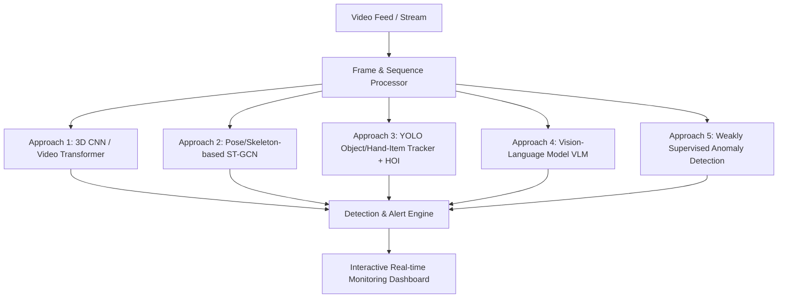

# Implementation Plan - Shoplifting Detection System

This document outlines the proposed technical approaches, system architecture, dataset strategies, and roadmap for building an end-to-end **Shoplifting Detection System** in the `shoplifting-detection` directory.

---

## Technical Approaches Overview

Shoplifting detection from surveillance video streams involves temporal action recognition, anomaly detection, and human-object interaction analysis. Below are five primary computer vision and deep learning approaches:



---

### Approach 1: Video Action Recognition (3D CNNs / Video Transformers)
- **Models**: SlowFast, X3D, TimeSformer, Video Swin, or VideoMAE fine-tuned on shoplifting/action datasets.
- **Mechanism**: Extracts spatio-temporal features directly from sequence clips (e.g., 16 or 32 frames) to classify actions such as *normal shopping*, *pocketing item*, *bagging item*, or *concealing*.
- **Pros**: End-to-end learning; captures visual textures and motion dynamics simultaneously.
- **Cons**: High computational complexity; requires continuous clip buffering.

---

### Approach 2: Pose / Skeleton-Based Action Recognition (ST-GCN / Pose-Transformer)
- **Models**: YOLOv8/v11-Pose or MediaPipe for 2D/3D keypoint estimation + Spatial-Temporal Graph Convolutional Network (ST-GCN) or Pose Transformer (e.g., PoseConv3D).
- **Mechanism**: Extracts keypoint trajectories of person joints (hands, shoulders, waist, knees). Detects unnatural motion paths (e.g., rapid hand-to-pocket or hand-to-jacket movements).
- **Pros**: Extremely fast, privacy-preserving (operates on vector keypoints), invariant to clothing/lighting changes.
- **Cons**: Misses contextual object information (e.g., whether an item was actually picked up or just touching clothes).

---

### Approach 3: Object Tracking + Hand-Object Interaction (HOI) Pipeline (Recommended for Practical Accuracy)
- **Models**: YOLOv8 / YOLOv11 (custom object detector for `Person`, `Item/Product`, `Shelf`, `Hand`, `Bag`, `Pocket`) + ByteTrack / DeepSORT + State Machine / Rule & GNN Classifier.
- **Mechanism**:
  1. Detect shoppers, shelf boundaries, and products.
  2. Track hand trajectories relative to products and concealment areas (pockets, backpacks, inside jackets).
  3. Trigger alert when `Hand + Product` moves into `Concealment Region` without passing through `Checkout / Basket`.
- **Pros**: High interpretability, actionable bounding-box visual overlays, robust against false positives.
- **Cons**: Requires multi-class object detection annotations.

---

### Approach 4: Zero-Shot / Few-Shot Vision-Language Models (VLM)
- **Models**: Qwen2-VL, Video-LLaVA, or MiniCPM-V for automated scene description and anomalous behavior reasoning.
- **Mechanism**: Passes key frame samples to a VLM with custom prompt templates asking to evaluate shoplifting indicators.
- **Pros**: Rich natural language explanations for alerts; strong out-of-box reasoning.
- **Cons**: Higher inference latency; best suited for secondary verification of candidate clips rather than raw 30 FPS stream processing.

---

### Approach 5: Weakly Supervised Video Anomaly Detection (WSAD)
- **Models**: Sultani et al. anomaly detection baseline, MIL (Multiple Instance Learning), or Video Anomaly Transformers.
- **Mechanism**: Learns a anomaly score trajectory over time for a video sequence.
- **Pros**: Trained using video-level labels (shoplifting vs normal) without needing per-frame bounding box annotations.
- **Cons**: May trigger false positives on unusual but non-malicious customer actions.

---

## Industry Standard & Low-Cost Analysis

| Approach | Industry Standard Rank | Cost & Compute Efficiency | Live Multi-Camera Scalability | Privacy & Compliance |
| :--- | :--- | :--- | :--- | :--- |
| **YOLO-Pose + Keypoint Sequence Classifier** (Approach 2) | ⭐⭐⭐⭐⭐ (Top Choice) | **Ultra Low** (Runs on CPU/Jetson/Raspberry Pi) | High (10+ streams on single edge box) | **GDPR Compliant** (Operates on skeleton vectors) |
| **YOLO + ByteTrack + HOI State Machine** (Approach 3) | ⭐⭐⭐⭐⭐ (Top Commercial Choice) | **Low - Medium** (YOLOv8n/v11n ONNX runtime) | High (4-8 streams per GPU / Mac M-series) | Medium (Visual Bounding Boxes) |
| **3D CNN / Video Transformer** (Approach 1) | ⭐⭐⭐ (Research Standard) | **High** (Requires heavy GPU per stream) | Low (1-2 streams per GPU) | Low (Full video frames processed) |
| **Vision-Language Model (VLM)** (Approach 4) | ⭐⭐ (Emerging for Verification) | **Very High** (VRAM intensive, high latency) | Very Low (Used for secondary verification only) | Low (Full video frames) |

### Why YOLO-Pose & YOLO-HOI are Industry Standard and Low Cost:
1. **Edge-Friendly Compute**: Real retail surveillance needs to process 16 to 64 CCTV camera streams concurrently. Using lightweight detection (YOLOv8n / YOLOv11n) exported to **ONNX / OpenVINO / TensorRT** reduces compute costs by 80-90% compared to heavy 3D video transformers.
2. **Skeleton Vector Reduction**: Extracting 17 2D keypoints per person reduces a 1080p frame (~6MB uncompressed) to a small array of ~34 floating point numbers. Running temporal action classification on pose vectors takes less than 1ms per person.
3. **Actionable Evidence**: Loss-prevention security teams require bounding box clips, timestamped entry/exit, and clear visual evidence, which spatial-temporal tracking pipelines provide naturally.

---

## Proposed Project Structure

We will create a modular Python package and web application in `shoplifting-detection/`:

```
shoplifting-detection/
├── README.md
├── docs/
│   ├── implementation_plan.md
│   └── research_notes.md
├── config/
│   └── default_config.yaml
├── data/
│   ├── download_dataset.py
│   └── sample_videos/
├── src/
│   ├── __init__.py
│   ├── detectors/          # YOLO / Pose detectors
│   ├── trackers/           # Multi-object tracking (ByteTrack/SORT)
│   ├── classifiers/        # Action / Anomaly classification
│   ├── pipeline/           # Video processing stream manager
│   └── utils/              # Visualization, logging, alert utilities
├── app/                    # Web UI Dashboard
└── tests/
```
