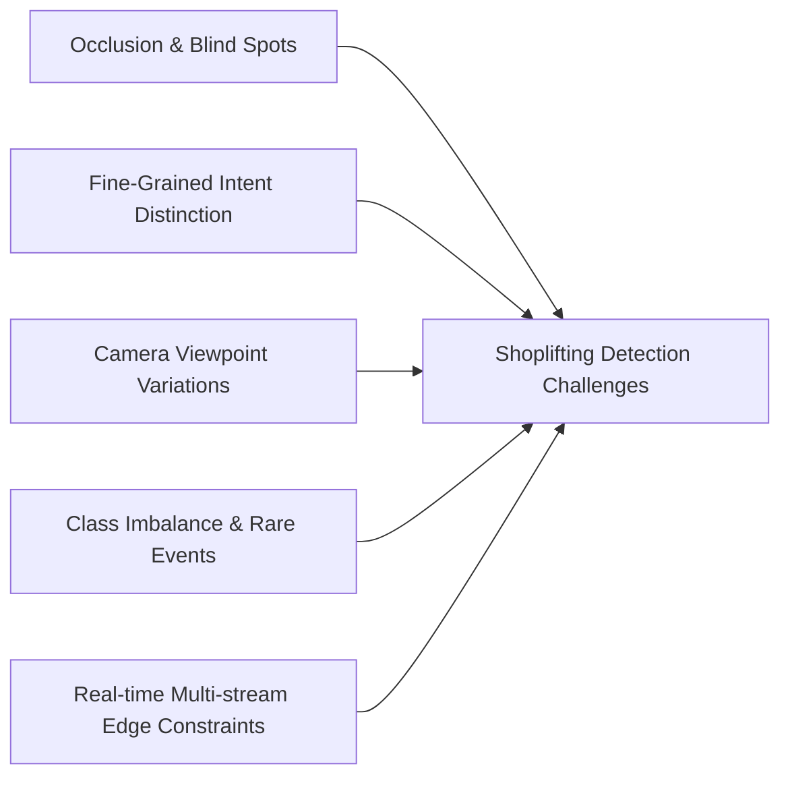
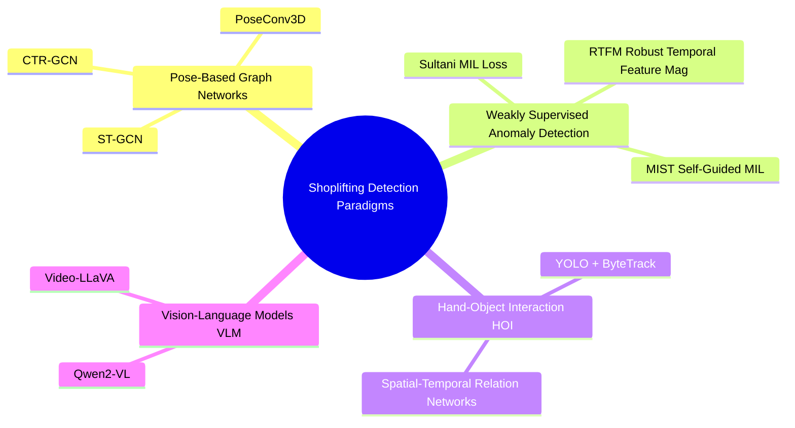
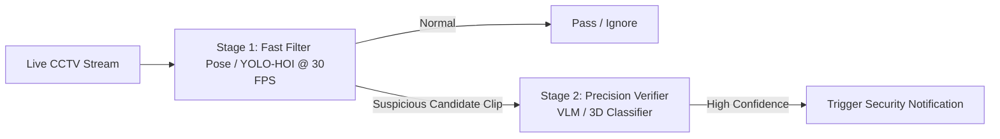

# Shoplifting Detection - Comprehensive Research Guide

This document presents an in-depth research summary on **Computer Vision & AI techniques for Shoplifting Detection**, covering state-of-the-art architectures, public datasets, evaluation metrics, real-world deployment challenges, and hardware cost benchmarks.

---

## 1. Problem Formulation & Key Challenges

Shoplifting detection is categorized under **Spatio-Temporal Action Recognition** and **Video Anomaly Detection (VAD)**. 



### Major Computer Vision Challenges:
1. **Fine-Grained Intent Distinction**: Distinguishing normal customer actions (inspecting a label, placing an item in a shopping cart/basket) from malicious actions (palming an item into a sleeve, pocket, or un-scanned bag).
2. **Occlusion**: The customer's body, aisle shelves, or other shoppers often block the camera's view of the hand and object at the moment of concealment.
3. **Extreme Class Imbalance**: In surveillance footage, 99.9% of video frames contain normal shopping behavior; shoplifting incidents represent less than 0.1% of stream time.
4. **Varied Camera Angles**: Ceiling-mounted wide-angle cameras (top-down view) present different perspective distortions compared to corner aisle cameras (eye-level view).

---

## 2. Model Architectures & Research Paradigms



> [!NOTE]
> **Modular & Combinable Approaches**: Each paradigm represents a distinct solution path. You can either pick **one primary approach** tailored to your constraints (budget, data, hardware) or **combine them into a multi-stage cascade pipeline**.

---

### Paradigm 1: Pose-Based Action Recognition (ST-GCN / CTR-GCN)
* **Concept**: Uses a 2D/3D human pose estimator (e.g., YOLOv8-Pose, MediaPipe, ViTPose) to extract keypoint coordinates $(x_i, y_i, c_i)$ over a sliding window of $T$ frames (e.g., 30–60 frames).
* **Architecture**:
  * Joints are nodes, and bones/trajectories are spatial-temporal graph edges.
  * **ST-GCN (Spatial Temporal Graph Convolutional Network)** applies graph convolutions across spatial joints and temporal frames.
* **Advantages**:
  * **Privacy preserving**: Does not require storing or processing full face/identity images.
  * **Ultra-lightweight**: Fast inference on edge CPUs / ARM processors.
  * **Invariant to clothing/lighting**: Focuses purely on movement dynamics.

---

### Paradigm 2: Weakly Supervised Video Anomaly Detection (WSAD)
* **Concept**: Avoids expensive frame-by-frame bounding-box annotations. Models are trained using only video-level tags (*Normal Video* vs *Shoplifting Video*).
* **Key Frameworks**:
  * **Sultani et al. (Deep MIL)**: Uses Multiple Instance Learning (MIL) loss to maximize the anomaly score gap between anomalous video segments and normal video segments.
  * **RTFM (Robust Temporal Feature Magnitude)**: Enhances feature magnitude differences between normal and abnormal events.
  * **MIST (Multiple Instance Self-Training)**: Uses pseudo-label generators to refine frame-level anomaly scores.

---

### Paradigm 3: Object Detection + Tracking + Hand-Object Interaction (HOI)
* **Concept**: Explicitly tracks hands, items, bags, and body pockets using object detection and multi-object tracking (MOT).
* **Pipeline**:
  $$\text{Detect Persons \& Hands} \rightarrow \text{Track Item Trajectory} \rightarrow \text{Spatial Proximity Check (Hand } \cap \text{ Pocket)} \rightarrow \text{State Machine Alert}$$
* **Advantages**:
  * High interpretability for security personnel.
  * Easy to combine with business logic rules (e.g., item placed in store basket vs item placed in personal jacket).

---

### Paradigm 4: Vision-Language Models (VLMs) for Secondary Verification
* **Concept**: Uses multimodal models (Qwen2-VL, Video-LLaVA, MiniCPM-V) to visually inspect candidate clips flagged by lower-stage detectors.
* **Sample Prompt**: `"Analyze this 5-second video snippet. Is the individual placing a store item into their personal clothing/bag without using a shopping cart? Respond with YES/NO and brief rationale."`

---

## 2.1 Decision Guide: How to Choose or Combine Approaches

### Single Approach Selection Guide:
* Choose **Paradigm 1 (Pose/ST-GCN)** if: You need maximum speed, ultra-low hardware cost (CPU/Mac/Jetson), and strict privacy/GDPR compliance.
* Choose **Paradigm 3 (YOLO + ByteTrack + HOI)** if: Security guards need clear bounding-box visual evidence (e.g., highlighting hand touching item near pocket).
* Choose **Paradigm 2 (WSAD)** if: You have lots of raw video footage labeled only as "shoplifting" or "normal" and cannot afford frame-by-frame bounding box annotations.
* Choose **Paradigm 4 (VLM)** if: You want zero-shot reasoning and natural language explanations without training custom models.

### Recommended 2-Stage Multi-Stage Cascade (Best Production Strategy):



* **Stage 1 (Fast & Cheap Filter)**: Processes 100% of live video streams continuously at 30 FPS using **Pose-GCN** or **YOLO-HOI**. It filters out 98% of normal activity.
* **Stage 2 (High-Accuracy Verification)**: When Stage 1 flags a 3-5 second clip with high suspicion score, **Stage 2 (VLM or 3D Transformer)** inspects *only that specific clip* to confirm intent and eliminate false positives before alerting security guards.


---

## 3. Standard Datasets & Benchmarks

| Dataset Name | Videos / Clips | Primary Focus | Annotation Type | Availability |
| :--- | :--- | :--- | :--- | :--- |
| **UCF-Crime** | 1,900 long videos (128 hours) | 13 crime types including **Shoplifting** | Video-level & temporal clip bounds | Public / Open |
| **ShanghaiTech** | 437 campus surveillance clips | General anomaly detection | Frame-level pixel masks | Public / Open |
| **Avenue Dataset** | 37 video clips | Pedestrian anomaly detection | Frame-level bounding boxes | Public / Open |
| **AI City Challenge** | Multi-camera retail streams | Retail customer behavior / Checkout | Spatial-temporal tracklets | Benchmark / Registration |

---

## 4. Hardware Compute & Cost Benchmark Matrix

Comparison for running a 4-camera 1080p @ 15 FPS surveillance processing node:

| Architecture Stack | Hardware Platform | Inference Latency | Max Camera Streams per Node | Approx Hardware Cost | Monthly Cloud/Edge Operational Cost |
| :--- | :--- | :--- | :--- | :--- | :--- |
| **YOLO-Pose + ST-GCN** | Intel Core i5 / Apple Mac Mini M2 | ~5-8 ms / frame | 8 - 12 streams | $500 - $600 | **~$5 - $10 / month** (Electricity only) |
| **YOLOv8n + ByteTrack + HOI** | Apple Silicon M2/M3 (MPS) / RTX 3060 | ~10-15 ms / frame | 6 - 8 streams | $800 - $1,200 | **~$15 - $25 / month** |
| **SlowFast 3D CNN** | Nvidia RTX 4090 / A100 | ~35-50 ms / clip | 2 - 3 streams | $2,000 - $6,000 | **~$150 - $300 / month** (Cloud GPU instance) |
| **Multimodal VLM (Qwen2-VL)** | Nvidia A100 (80GB VRAM) | ~1.5 - 3.0 sec / query | Batch verification only | $10,000+ | **~$0.005 per query (API) / $500+ (Dedicated GPU)** |

---

## 5. Production Pipeline Design Pattern

```
[ CCTV RTSP Stream ]
         │
         ▼
┌─────────────────────────────────┐
│ 1. Frame Sampling & Preprocessing│
│    (1080p -> 640x640 @ 15 FPS)  │
└────────────────┬────────────────┘
                 │
                 ▼
┌─────────────────────────────────┐
│ 2. Primary Fast Stage (YOLO-Pose)│
│    Extract 17 Keypoints / Person│
└────────────────┬────────────────┘
                 │
                 ▼
┌─────────────────────────────────┐
│ 3. Multi-Object Tracker         │
│    (ByteTrack - Track IDs)      │
└────────────────┬────────────────┘
                 │
                 ▼
┌─────────────────────────────────┐
│ 4. Temporal Classifier (ST-GCN) │
│    Evaluates 30-frame window    │
└────────────────┬────────────────┘
                 │
          Score > Threshold ?
         ┌───────┴───────┐
       No│               │Yes
         ▼               ▼
   [ Normal Frame ]   ┌────────────────────────────────┐
                      │ 5. Alert Engine & Evidence Log  │
                      │    - Save 10s MP4 Clip          │
                      │    - Push Alert Notification    │
                      └────────────────────────────────┘
```
